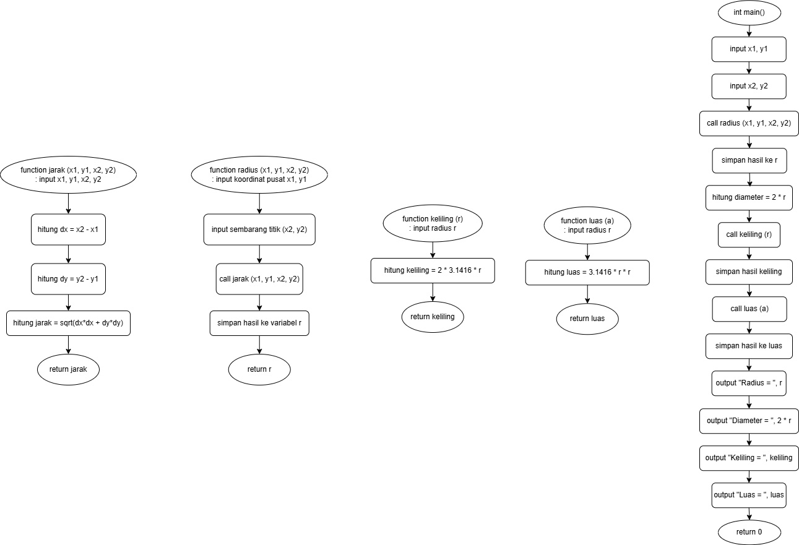

## Penjelasan Program

Program ini ditulis dalam **C++** untuk menghitung berbagai properti lingkaran berdasarkan dua titik koordinat:
- Titik pusat `(x1, y1)`
- Titik pada keliling `(x2, y2)`

---

### Fungsi-Fungsi

- **`jarak(x1, y1, x2, y2)`**  
  Menghitung jarak antara dua titik dengan rumus:  
  √((x2 - x1)² + (y2 - y1)²)

- **`radius(x1, y1, x2, y2)`**  
  Mengembalikan jari-jari lingkaran dengan memanggil fungsi `jarak()`.

- **`keliling(r)`**  
  Menghitung keliling lingkaran dengan rumus:  
  2 × π × r

- **`luas(r)`**  
  Menghitung luas lingkaran dengan rumus:  
  π × r²

---

### Alur Program

1. Pengguna memasukkan dua titik koordinat: pusat `(x1, y1)` dan titik keliling `(x2, y2)`.  
2. Program menghitung jari-jari menggunakan `radius()`.  
3. Berdasarkan jari-jari, program menghitung:
   - Diameter = 2 × r  
   - Keliling melalui `keliling(r)`  
   - Luas melalui `luas(r)`  
4. Hasil perhitungan ditampilkan ke layar.

---

